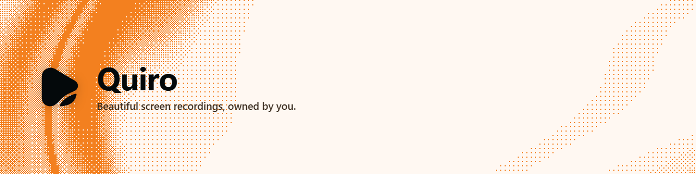

<div align="center">
  

  <br />

  [](https://github.com/Nweremizu/quiro/actions/workflows/ci.yml)
  
  
</div>

<br />

Quiro is a native screen studio for Windows and macOS. It turns a raw
capture into a polished, portable story — camera, microphone, and system
audio recorded together, then composed on a focused timeline — without
moving your workflow into a browser or an account.

## Why Quiro

- **Capture the whole story.** Record your screen, camera, microphone, and
  system audio together in one native workflow.
- **Shape the pacing.** Trim the noise, arrange the moment, and make every
  second earn its place on a focused timeline.
- **Guide every eye.** Use zooms, cursor emphasis, and framing to direct
  attention without distracting from the idea.
- **Add context in the frame.** Layer captions, text, and annotations
  directly onto the canvas so meaning never gets lost.
- **Design, not decoration.** Compose backgrounds, crop, spacing, shadows,
  and camera placement with intent.
- **Finish in the right format.** Export as MP4, MOV, or GIF and publish
  wherever your audience already is.
- **Local by default.** Capture, edit, and export on your own machine —
  your work stays in files you control, not an account you have to
  maintain.

## Tech stack

| Layer | Technology |
| --- | --- |
| Desktop shell | [Tauri v2](https://v2.tauri.app/) + React |
| Recording pipeline | Rust, FFmpeg, native OS capture APIs |
| Rendering & editor | Rust (`packages/crates/rendering`, `quiro-text`) |
| Marketing site | Next.js (`apps/web`) |
| Package manager | pnpm workspaces + Turborepo |

## Getting started

**Prerequisites:** Node `>= 22.13`, [pnpm](https://pnpm.io) `11.22.0`, a
stable Rust toolchain, and platform build tools (Xcode command line tools
on macOS, the Visual Studio Build Tools + WebView2 on Windows).

```bash
pnpm install
pnpm setup:native   # fetches FFmpeg + ONNX Runtime for your platform
pnpm dev            # launches the desktop app
```

Other useful commands:

```bash
pnpm dev:web        # marketing site, local dev
pnpm lint           # Biome
pnpm typecheck      # turbo run typecheck across the workspace
pnpm check          # repo self-checks (geometry/arrow invariants, etc.)
cargo test --workspace
```

## Project structure

```
apps/
  desktop/          Tauri app: React UI + the src-tauri Rust backend
  web/               Next.js marketing site
packages/
  crates/           ~40 Rust crates: recording, encoding, rendering, capture, camera, audio…
  ui/               Shared React component library
  config/           Shared TS/build config
```

## Testing & CI

- `cargo test --workspace` and `pnpm check` run on every push via
  `.github/workflows/ci.yml`.
- The synthetic A/V-sync fuzz matrix (`packages/crates/recording/tests/sync_matrix.rs`)
  runs on its own schedule in `.github/workflows/sync-tests.yml` rather than
  blocking every push — see that file for how to reproduce a specific
  failure locally via `CAP_SYNC_MATRIX_SEED`.

## Releasing

See [`RELEASING.md`](./RELEASING.md) for how a change ships — version
bumps, changelog entries, and the nightly channel.

## Contributing

See [`AGENTS.md`](./AGENTS.md) for repository conventions (formatting,
commit style, and how the Rust and TypeScript sides of the codebase are
organized).
